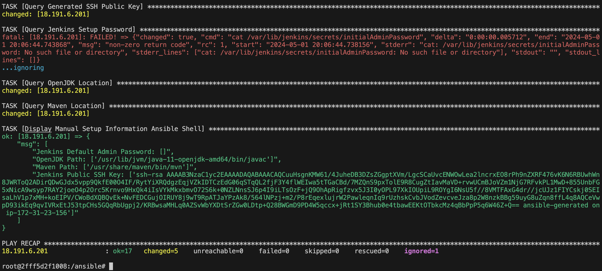
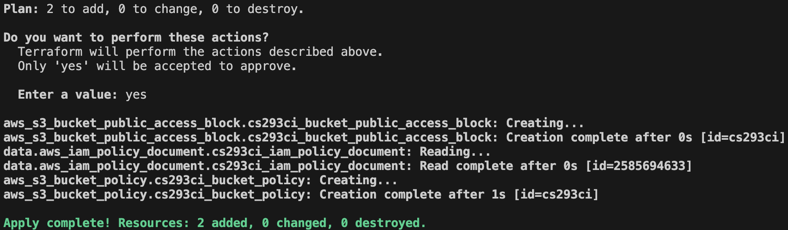
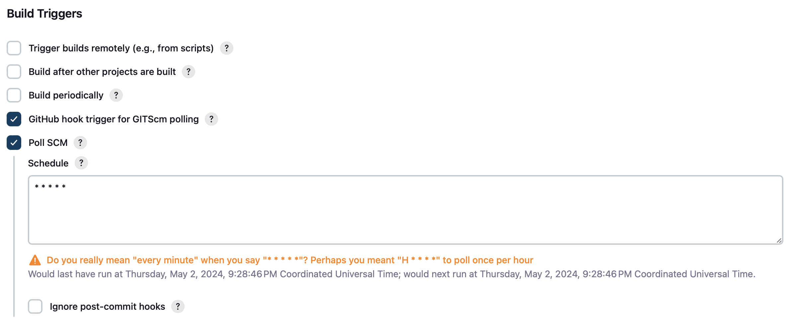

# UWGB Cloud Computing CI

Automation Scripts for the UWGB Cloud Computing Final Project

## Project Purpose

For the final project for the Cloud Computing class held at the University of Wisconsin &ndash; Green Bay, students were tasked to create a Continuous Deployment (CD) pipeline to automate the deployment of a static web server from a GitHub repository using Jenkins and an S3 bucket. The purpose of this repository is to house the automation and Infrastructure as Code (IaC) scripts used during the course of the project.

## Ansible

[Ansible](https://www.ansible.com/) is a server automation tool used extensively in the industry. For the purpose of this project, Ansible was utilized to provision and configure the Jenkins server with the proper dependencies and ssh key necessary for the completion of this project. By executing the Ansible playbook on a target Ubuntu server, the Jenkins server should be configured in a desired end state for this project and need no further manual intervention. The Ansible code used to configure the Jenkins server is housed in the `./ansible` directory.

> [!IMPORTANT]
> The IP addresses stored in the Ansible configuration are *NOT* up-to-date and must be updated to reflect the desired server to be provisioned. This piece of the configuration is project-specific and must not be left as default.

To configure a target server (or host) using this Ansible script, a control node running Linux is needed for this task. If your host operating system is not running Linux, a hypervisor such as the Windows Subsystem for Linux (WSL) or Vagrant will suffice for this purpose. After configuring this Linux environment, ensure that this Ansible configuration is accessible from it.

Inside this Linux control node, ensure that the Ansible inventory file accurately reflects the host to be configured (including username and ssh key configuration). Also ensure that the Ansible playbook references the inventory file. After doing this, execute the following commands inside the Ansible configuration directory:

```shell
ansible-playbook -i inventory/servers.ini pb_install_jenkins.yaml
```

Upon successful execution of the playbook, the following (or a similar) message should be visible in the console:



## Terraform

[Terraform](https://www.terraform.io/) is an Infrastructure as Code (IaC) automation tool mean to automate the deployment of cloud resources in a cloud-agnostic way. The Terraform configuration housed in this repository creates an S3 bucket, configures public access, and configures a CloudFront distribution to interface with it. The Terraform configuration is housed in the `./website` directory.

To apply this configuraion, the [AWS CLI](https://aws.amazon.com/cli/) must first be configured on the system. After this is done, navigate to the Terraform configuration directory and execute the following commands:

```shell
terraform init
terraform apply
```

After executing these commands, a proposed execution plan will appear &ndash; into which you can answer *yes* to the proposed changes &ndash; and these changes should be reflected on the corresponding dashboards for your AWS account resources.



## Jenkins

After creating a Jenkins server using Ansible and provisioning the cloud infrastructure by executing the Terraform script, the Jenkins server is ready to be configured.

The first step is to create a *freestyle* project that will utilize the AWS CLI tools installed on the build agent via the execution of the Ansible script. After doing this, create a shell build step to sync the website contents to the S3 bucket by adding the following contents:

```shell
aws s3 sync --delete ./ s3://{bucket_name}/
```

### Build Triggers

In order to have Jenkins respond to changes that occur in a specific branch of a git repository, there are a couple of different ways to implement this &ndash; either through a GitHub WebHook or through a poll.

For the webhook to work, the Jenkins webhook plugin must be installed on the Jenkins instance itself. Furthermore, the instance must be facing the public internet. For the polling functionality to work, a Linux cron job must be created to poll the repository for changes over a specific interval (such as every minute). The different options are shown below:


